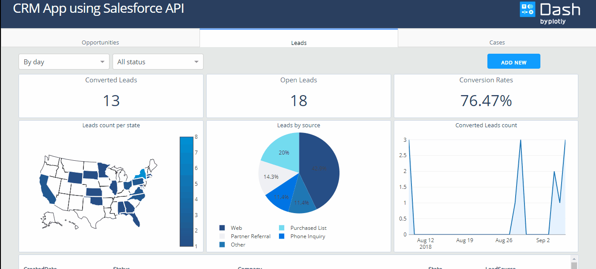

# dash-salesforce-crm
This is a demo of the Dash interactive Python framework developed by [Plotly](https://plot.ly/).

Dash abstracts away all of the technologies and protocols required to build an interactive web-based application and is a simple and effective way to bind a user interface around your Python code.

To learn more check out our [documentation](https://plot.ly/dash).

This app uses Salesforce API in order to implement a custom CRM dashboard. The API is used via the module [Simple-Salesforce](https://pypi.org/project/simple-salesforce/). 

👉 [Explore the app](https://dash-gallery.plotly.host/dash-salesforce-crm).
